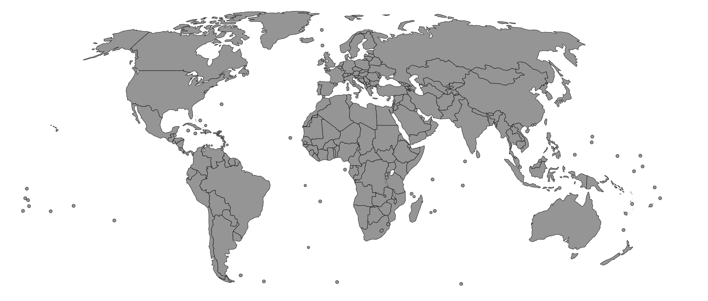

# svg-world-map



Built with TypeScript React components, includes 253 countries, territories and partially recognised countries/territories. Each country is stored in an individual component and then imported into the main MapSVG.tsx file.

# Installation

Navigate to your preferred directory and run:
```
git clone https://github.com/ChengCPU/svg-world-map
```
Import the **MapSVG.tsx** file:
```
import MapSVG from './MapSVG'
```
Render the component:
```
<MapSVG />
```

# Usage

To change the fill color, replace the default value with any valid rgb string:

```
style={{fill: 'rgb(149,149,149)'}} (Default, grey)
style={{fill: 'rgb(255,0,0)'}} (Red)
style={{fill: 'rgb(0,0,0)'}} (Black)
```

The border color can also be changed by with the same method:

```
stroke='black' (Default, black)
stroke='rgb(255,0,0)' (Red)
stroke='rgb(0,0,255)' (Blue)
```
