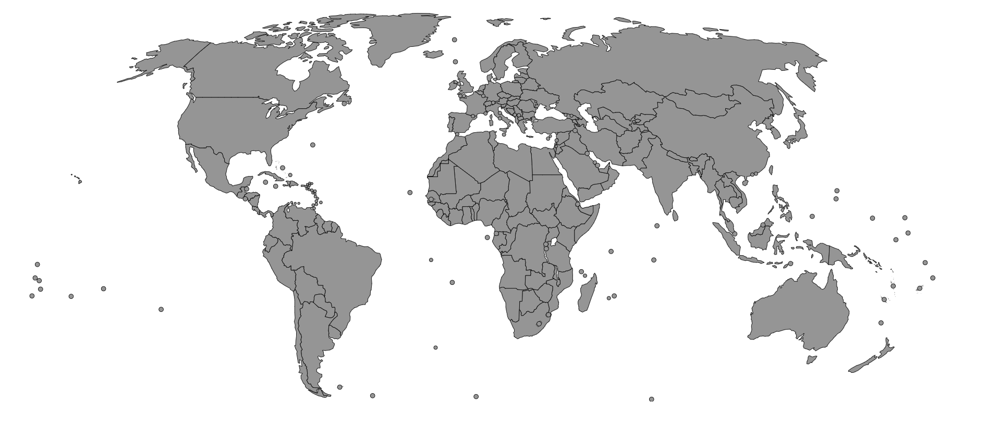

# svg-world-map



Built with TypeScript React components, includes 250 countries, territories and partially recognised territories. Each country is stored in an individual component and then imported into the main MapSVG.tsx file.

# Installation

Navigate to your preferred directory and run:
```
git clone https://github.com/ChengCPU/svg-world-map
```
Import the **MapSVG.tsx** file:
```
import MapSVG from './MapSVG'
```
Render the component:
```
<MapSVG />
```